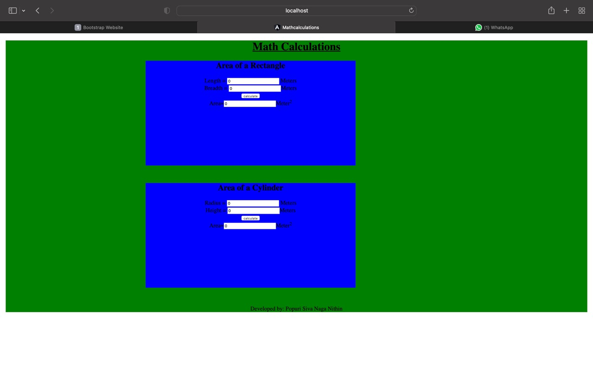

# AngularCalculation

# Web Page for Mathematical Calculations using Angular

## AIM:
To design a dynamic website to perform mathematical calculations using Angular Framwork

## DESIGN STEPS:

### Step 1:

Requirement collection.

### Step 2:

Creating the layout using HTML and CSS in component.html file

### Step 3:

Write typescript to perform the calculations.

### Step 4:

Validate the layout in various browsers.

### Step 5:

Validate the HTML code.

### Step 6:

Publish the website in the given URL.

## PROGRAM :
```<body>
    <div class="container">
        <h1>Math Calculations</h1>
        <div class="subcontainer">
            
            <Rectangle-Area></Rectangle-Area>
        </div>
        <div class="subcontainer">
            <Cylinder-Area></Cylinder-Area>
        </div>
        <div class="footer">
            Developed by: Popuri Siva Naga Nithin
        </div>
    </div>
</body>
```

## OUTPUT:



## Result:
